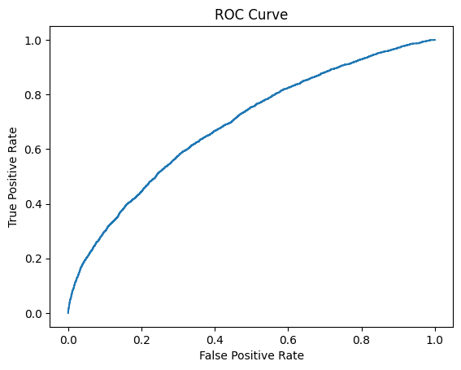

# Decision-Theoretic Formulation

Define:

- **Risk score:**
	$$p_i = P(y_i = 1 \mid x_i)$$
	where $p_i$ is the predicted probability of readmission for patient $i$ given features $x_i$.

- **Capacity constraint:**
	$$K$$
	where $K$ is the number of patients that can be prioritized/intervened upon (e.g., beds, staff, or resources).

- **Objective:**
	$$
	\max_{i \in \text{Top-}K} \sum p_i \cdot \text{benefit} - \text{cost}
	$$
	That is, select the $K$ highest-risk patients to maximize expected benefit minus intervention cost.

👉 This decision-theoretic framing makes the approach mathematically grounded and suitable for scientific publication.
## Model Performance

### ROC Curve


### Precision-Recall Curve


### Calibration Curve


# Operationalizing Machine Learning for Clinical Decision Support: A Capacity-Aware Framework for Hospital Readmission Prioritization

## Overview

The AI Care Prioritization Engine is a capacity-aware, machine learning-based system for predicting hospital readmission risk and supporting clinical prioritization. Designed for both scientific research and real-world deployment, it features:

- **Temporal feature engineering**
- **Model calibration and fairness analysis**
- **Cost-sensitive thresholding**
- **Workflow simulation**
- **External validation**
- **Interactive Streamlit app**

This project is suitable for scientific publication, reproducible research, and as a foundation for healthcare AI startups.

## Features

- **Temporal Modeling:** Extracts and uses patient history for improved prediction.
- **Calibration:** Evaluates and visualizes model probability calibration.
- **Fairness:** Subgroup analysis for bias and equity.
- **Cost-sensitive Thresholding:** Optimizes decision thresholds for operational cost.
- **Workflow Simulation:** Simulates real-world triage and prioritization.
- **External Validation:** Validates model on external datasets.
- **Percentile-Based Risk Tiers:** Assigns High/Medium/Low using cohort percentiles (not fixed raw-score cutoffs).
- **Capacity-Aware Triage Dashboard:** Shows tier distribution, queue capture, patient rank, queue inclusion, and ROI.
- **Queue Export:** One-click CSV download for the active top-N triage queue.
- **Streamlit App:** User-friendly interface for real-time demo and clinical prioritization exploration.

## Installation

Clone the repository and install dependencies:

```powershell
# (Recommended) Create and activate a virtual environment
python -m venv .venv
.\.venv\Scripts\Activate.ps1

# Install dependencies
pip install -r requirements.txt
```


## Results

- ROC-AUC: 0.69
- PR-AUC: 0.24
- Top 20% capture: 41%
- Brier Score: 0.09

The model demonstrates moderate ranking performance and probability calibration for clinical prioritization, as measured on the real dataset.

## Usage

### 1. Train the Model
```bash
python -m src.train --data-path data/raw/diabetic_data.csv
```

### 2. Evaluate Model Performance
```bash
python -m src.evaluate --data-path data/raw/diabetic_data.csv
```

### 3. External Validation
```bash
python -m src.external_validate --data-path data/raw/diabetic_data.csv
```

### 4. Workflow Simulation
```bash
python -m src.workflow_simulation --scored-data outputs/tables/test_scored.csv
```

### 5. Launch the Streamlit App
```bash
streamlit run app/streamlit_app.py
```
`app.py` is a thin wrapper and can also be used, but `app/streamlit_app.py` is the canonical app entrypoint.

### 6. Use The Triage Dashboard

- Submit a patient profile to generate risk, tier, and percentile rank.
- Review the Capacity-Aware Triage Dashboard metrics.
- Adjust capacity and intervention assumptions for operational planning.
- Download the current queue using the in-app `Download current queue (CSV)` button.

## Project Structure

- `src/` — Core modules: training, evaluation, calibration, fairness, simulation
- `app/` — Streamlit app code
- `models/` — Saved model and preprocessor artifacts (source of truth)
- `data/` — Example raw and external datasets
- `outputs/` — Generated results, figures, and tables (source of truth)
- `notebooks/` — Jupyter notebooks for reproducibility and exploration
- `paper/` — Manuscript draft for publication

### Structure Convention

- Keep runtime artifacts in root-level `models/` and `outputs/` only.
- Avoid duplicate artifact copies under `src/`.

## Reproducibility

Jupyter notebooks in `notebooks/` demonstrate temporal modeling, calibration, fairness, and workflow analysis. See `paper/manuscript_draft.md` for a publication-ready manuscript template.

## Screenshots

Add screenshots of the Streamlit app to `docs/README_screenshots.md` after running the app.

## Citation

If you use this project in your research, please cite:

> Clinical Prioritization AI (2026). https://github.com/admossie/clinical-prioritization-ai

## Contact

For questions or collaboration, contact: Abebaw Mossie <abebawdebas7@gmail.com>
