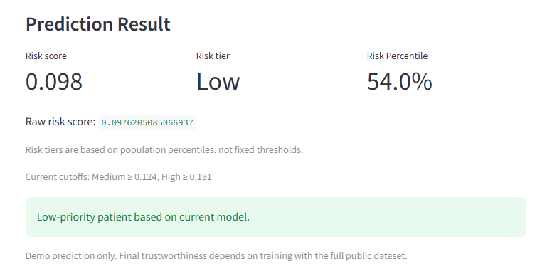
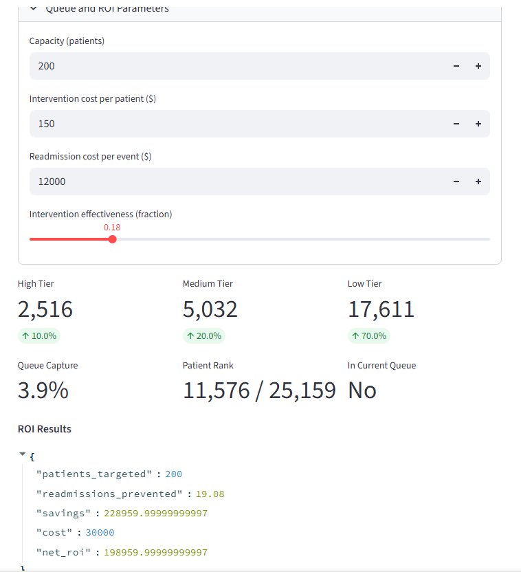
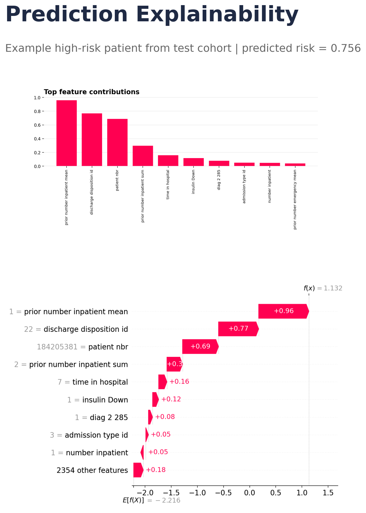
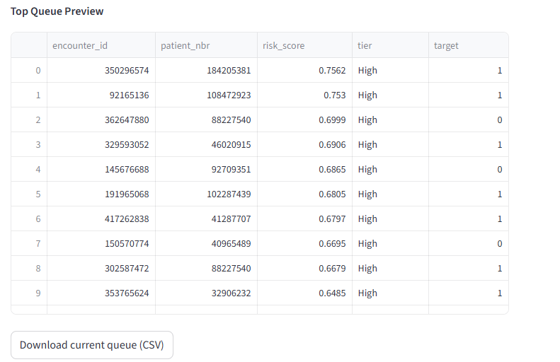

# App Screenshots

These screenshots document the current Streamlit demo experience in a form that is suitable for the repository README, project overviews, and publication support materials.

To regenerate the explainability image from the saved model artifacts, run:

```powershell
python outputs/generate_explainability_figure.py
```

## 1. Risk Prediction

Shows the primary prediction interface with the patient-level risk output.



## 2. Capacity-Aware Triage Dashboard

Shows the operational dashboard with queue planning and ROI context.



## 3. Prediction Explainability

Shows feature-level explanation for a high-risk patient example from the scored test cohort.



## 4. Queue Export

Shows the top queue preview and CSV export action for the active prioritization queue.

