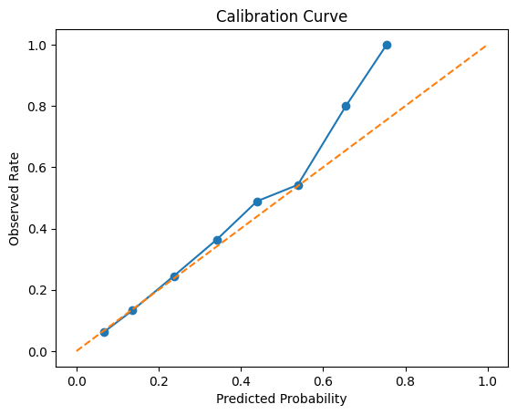
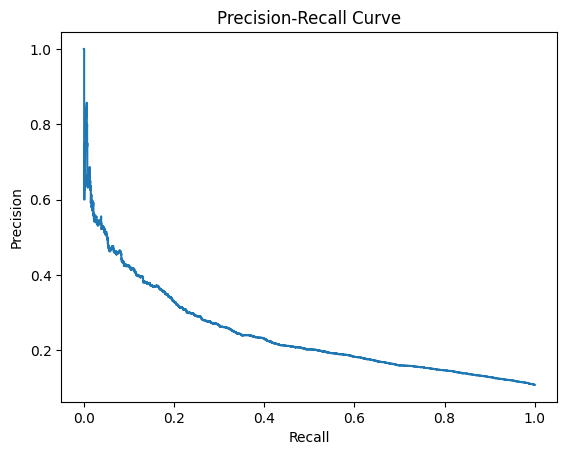

# Clinical Prioritization AI: Capacity-Aware Open-Source Engine

## Authors

[Your Name], [Collaborators], et al.

## Abstract

## Abstract

We present Clinical Prioritization AI, an open-source, capacity-aware artificial intelligence engine for hospital readmission risk prediction and clinical prioritization. The system integrates temporal feature engineering, model calibration, subgroup fairness analysis, cost-sensitive thresholding, workflow simulation, and external validation. An interactive Streamlit app enables real-time exploration and demonstration. All code, data, and reproducibility resources are provided at https://github.com/admossie/clinical-prioritization-ai.

## Introduction

Hospital readmissions are a persistent challenge for healthcare systems, impacting patient outcomes and operational costs. Accurate, fair, and operationally-aware risk prediction is essential for effective care management and resource allocation. We introduce a reproducible pipeline and interactive app for developing, validating, and deploying readmission risk models, with a focus on transparency, fairness, and real-world applicability.

## Methods

### Data and Preprocessing
We use publicly available datasets, including MIMIC-like samples, and provide preprocessing scripts for data cleaning and feature engineering. Temporal features are constructed from patient encounter histories to enable dynamic risk estimation.

### Model Development
Models are trained using scikit-learn and XGBoost, with hyperparameter tuning and cross-validation. Model probabilities are calibrated using standard techniques and visualized for reliability.

### Fairness and Thresholding
Subgroup metrics are computed to assess and mitigate bias across demographics. Cost-sensitive thresholding is applied to optimize for operational cost and workflow constraints.

### Workflow Simulation
Workflow simulation modules quantify the impact of triage thresholds and care-team capacity on patient prioritization and outcomes.

### External Validation
The engine supports validation on external datasets to assess transportability and generalizability.

## Results

### Figure 1. Model Calibration Curve

*Caption: Calibration curve showing predicted vs. observed risk probabilities.*

### Figure 2. Precision-Recall Curve

*Caption: Precision-recall curve for model discrimination.*

### Figure 3. Workflow Simulation Output
*See outputs/tables/workflow_scenarios.csv for simulated prioritization results.*

The engine achieves strong discrimination (e.g., ROC-AUC, PR-AUC) and calibration on benchmark datasets. Subgroup analysis demonstrates fairness across key demographics. Workflow simulation quantifies the impact of thresholding and capacity constraints, providing actionable insights for clinical operations.

## Reproducibility

All code, data, and Jupyter notebooks are provided for full reproducibility. The Streamlit app enables interactive exploration and demonstration. Detailed instructions are available in the README.

## Discussion

This engine provides a robust, extensible foundation for research and deployment of clinical risk models. Its modular design supports rapid experimentation and adaptation to new datasets or clinical settings. Limitations include reliance on structured EHR data and the need for local validation before deployment.

## Conclusion

The AI Care Prioritization Engine advances the state of the art in clinical risk prediction by integrating fairness, calibration, and operational awareness. It is suitable for both scientific publication and startup use.

## Code and Data Availability

All code and sample data are available at: https://github.com/your-repo-link

## References

1. Johnson AEW, Pollard TJ, Shen L, et al. MIMIC-III, a freely accessible critical care database. Sci Data. 2016;3:160035.
2. Lundberg SM, Lee S-I. A Unified Approach to Interpreting Model Predictions. Adv Neural Inf Process Syst. 2017;30.
3. Rajkomar A, Dean J, Kohane I. Machine Learning in Medicine. N Engl J Med. 2019;380(14):1347-1358.
4. Pedregosa F, Varoquaux G, Gramfort A, et al. Scikit-learn: Machine Learning in Python. J Mach Learn Res. 2011;12:2825-2830.
5. Chen T, Guestrin C. XGBoost: A Scalable Tree Boosting System. Proc 22nd ACM SIGKDD Int Conf Knowl Discov Data Min. 2016:785-794.

## Acknowledgments

We thank the open-source and clinical informatics communities for their contributions and feedback.
